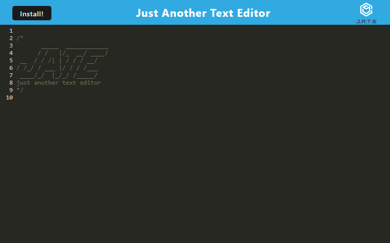

# 19-PWA-Text-Editor

This is my submission for Chapter 19 PWA. 

## User Story

```md
AS A developer
I WANT to create notes or code snippets with or without an internet connection
SO THAT I can reliably retrieve them for later use
```

## Technologies Used

```
Node.JS
Webpack PWA 
Workbox
```

## Links to Deployed Github
Github: https://github.com/GDonna/19-PWA-Text-Editor.git
Deployed: https://gdonna.github.io/19-PWA-Text-Editor/
Heroku: https://challenge-19-pwa-text-editor-2fefe3113250.herokuapp.com/

